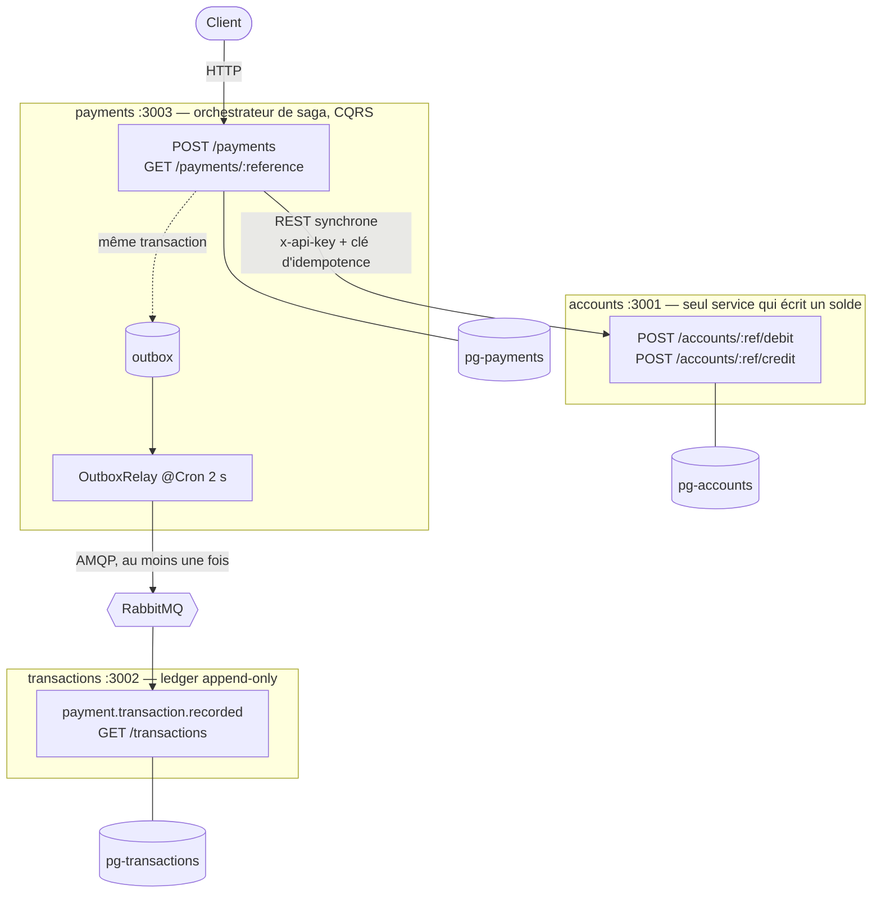
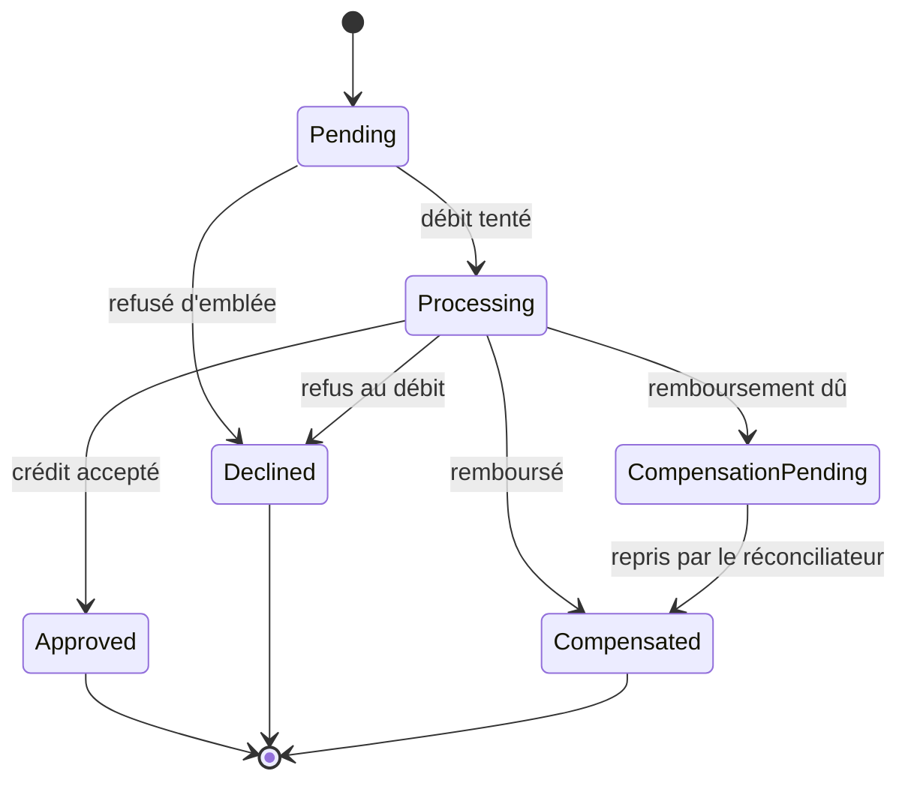
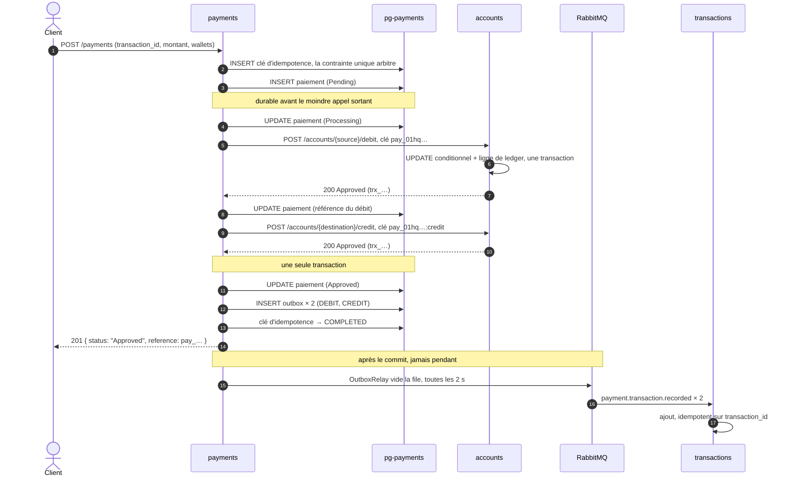
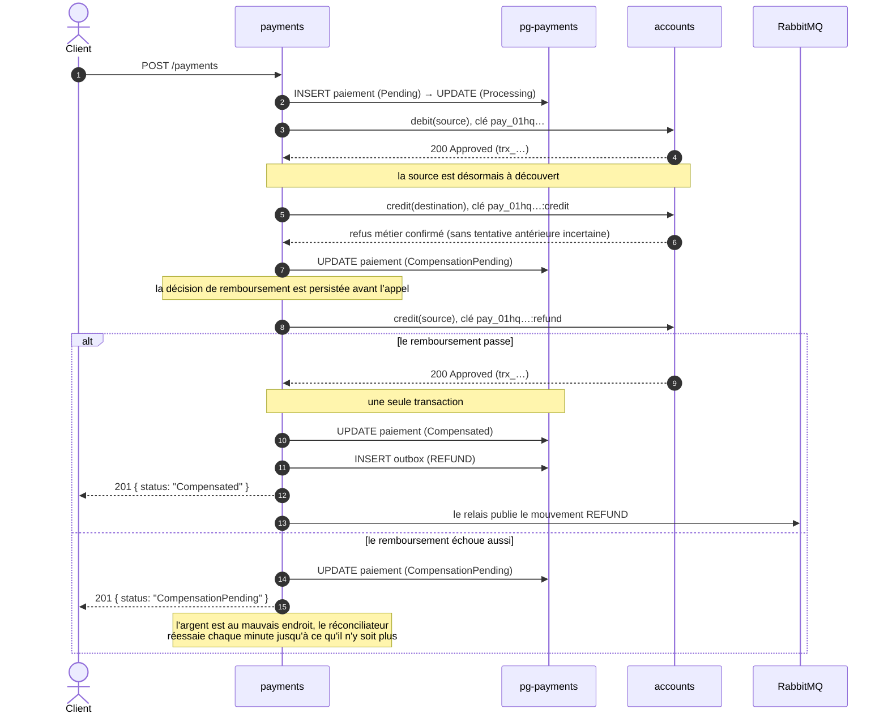

# paynad — mini-plateforme de paiement

Trois microservices NestJS indépendants, une base PostgreSQL chacun, reliés par
du REST synchrone pour le mouvement d'argent et par RabbitMQ pour le ledger.
Tout tourne en local avec Docker Compose.

J'ai écrit ce README pour qu'on puisse reprendre le projet sans moi. Il explique
donc autant les raisons que le fonctionnement, et il dit aussi ce qui ne marche
pas encore : voir [Sécurité](#sécurité) et [Ce que je ferais
ensuite](#ce-que-je-ferais-ensuite).



`payments` débite et crédite via `accounts` en REST, puis notifie `transactions`
de façon asynchrone. Un débit refusé n'atteint jamais le ledger ; un crédit explicitement refusé
est compensé. Un résultat de crédit inconnu est réconcilié sans remboursement automatique.

## Prérequis

Docker avec Compose v2 suffit à faire tourner la stack. L'outillage côté machine
(IDE, tests) demande Node 20+ et **pnpm 9** :
`corepack enable && corepack prepare pnpm@9 --activate`, ou `npx pnpm@9 install`.
pnpm 7 plante sur les versions récentes de Node avec `ERR_INVALID_THIS`.

## Démarrage rapide

```bash
cp .env.example .env      # ou laissez `make up` s'en charger
make up                   # construit les images, démarre tout, attend la santé
make migrate              # applique les migrations TypeORM des trois bases
make seed                 # charge les jeux de données de développement
```

`make up && make migrate && make seed` : c'est tout ce dont un clone frais a
besoin. Comptez quelques minutes sur le premier `make up`, qui construit trois
images multi-étapes — il reste parfois une minute sans rien afficher, c'est
normal. Les suivants repartent du cache et prennent quelques secondes.

Si `make up` s'arrête sur un port déjà pris, c'est en général un PostgreSQL
local sur 5433-5435 ; changez les `*_DB_EXPOSED_PORT` dans `.env` plutôt que de
tuer le vôtre.

### Vérifier que ça tourne

```bash
make ps                          # les trois services doivent afficher (healthy)
curl -s localhost:3001/health    # {"code":"200","message":"SUCCESS","data":{...,"status":"Healthy"}}
```

Pour voir un paiement traverser les trois services sans écrire une requête,
importez la collection [Postman](#postman) et lancez son dossier **Scenario** :
il crée un utilisateur, deux wallets, règle un paiement, le rejoue et finit sur
un refus. Sinon, [L'API par l'exemple](#lapi-par-lexemple) donne les `curl`
équivalents, endpoint par endpoint.

| Surface           | URL                              |
|-------------------|----------------------------------|
| docs accounts     | http://localhost:3001/docs       |
| docs transactions | http://localhost:3002/docs       |
| docs payments     | http://localhost:3003/docs       |
| interface RabbitMQ| http://localhost:15672           |

Les bases sont exposées sur 5433 (accounts), 5434 (transactions) et 5435
(payments) pour inspection ; `make psql SERVICE=accounts` ouvre un shell sur
l'une d'elles.

`make help` affiche la liste complète des cibles.

### Arrêter, et repartir de zéro

```bash
make down    # arrête tout, garde les données
make clean   # arrête, supprime volumes, images locales et dist/
```

### Sans `make`

Les cibles ne font qu'enchaîner du `docker compose` ; sous Windows sans WSL,
voici les équivalents des quatre commandes du démarrage :

```bash
cp .env.example .env
docker compose up -d --build --wait --renew-anon-volumes

# migrations et fixtures, service par service (accounts, transactions, payments)
docker compose exec -T accounts sh -lc 'cd /app/services/accounts && pnpm typeorm migration:run'
docker compose exec -T accounts sh -lc 'cd /app/services/accounts && pnpm seed'

docker compose down --remove-orphans
```

Le seed est idempotent, indexé sur l'email du client et le libellé du wallet :
`make seed` peut être relancé à volonté sans dupliquer une ligne ni recréditer
un wallet. Il charge **trois utilisateurs et cinq wallets** aux soldes
volontairement variés :

| Utilisateur | Wallet | Solde | Statut | À quoi il sert |
|-------------|--------|-------|--------|----------------|
| Awa Traoré | Compte principal | 500 000 | Active | la source approvisionnée du paiement de démonstration |
| Awa Traoré | Compte épargne | 0 | Active | un wallet vide, pour le chemin `INSUFFICIENT_BALANCE` |
| Kofi Mensah | Compte principal | 25 000 | Active | un solde modeste, qu'un paiement peut épuiser |
| Kofi Mensah | Compte marchand | 75 000 | Active | la destination du paiement de démonstration |
| Salif Diallo | Compte bloqué | 10 000 | Frozen | le chemin `WALLET_FROZEN`, et le cas de compensation |

`transactions` et `payments` chargent leur propre historique : un débit, le
remboursement qui le compense, un crédit, et un paiement par état terminal.

Les paiements du seed sont construits en faisant traverser à l'agrégat des
transitions légales, pas en insérant des lignes directement. C'est un peu plus
long à écrire, mais ça garantit qu'aucune fixture ne décrit un état que le code
refuserait de produire.

## Environnement

Rien n'est codé en dur : `docker-compose.yml` lit chaque valeur dans `.env`, et
chaque service valide son propre environnement au démarrage avec
`class-validator`. Un mot de passe manquant ou une URL amont à moitié définie
arrête le processus, au lieu de produire un conteneur qui démarre puis échoue à
la première requête.

| Variable | Défaut dans `.env.example` | Utilisée par |
|----------|----------------------------|--------------|
| `COMPOSE_PROJECT_NAME` | `paynad` | compose |
| `NODE_ENV`, `LOG_LEVEL`, `DB_LOGGING` | `development`, `debug`, `false` | les trois services |
| `POSTGRES_VERSION`, `RABBITMQ_VERSION` | `16-alpine`, `3.13-management-alpine` | compose |
| `<SERVICE>_DB_NAME` / `_USER` / `_PASSWORD` | propre à chaque service | ce service uniquement |
| `<SERVICE>_DB_HOST` / `_PORT` | `pg-<service>` / `5432` | ce service uniquement |
| `<SERVICE>_DB_EXPOSED_PORT` | `5433` / `5434` / `5435` | inspection depuis la machine |
| `RABBITMQ_USER` / `_PASSWORD` / `_VHOST` / `_HOST` / `_PORT` | `paynad` / … / `/` / `rabbitmq` / `5672` | payments, transactions |
| `RABBITMQ_EXPOSED_PORT`, `RABBITMQ_MANAGEMENT_PORT` | `5672`, `15672` | machine hôte |
| `INTERNAL_API_KEY` (16 caractères minimum) | `dev-internal-key-change-me` | guard d'`accounts`, envoyée par `payments` |
| `INTERNAL_API_SECRET` (32 caractères minimum) | `dev-internal-secret-…` | idem |
| `ACCOUNTS_PORT` / `TRANSACTIONS_PORT` / `PAYMENTS_PORT` | `3001` / `3002` / `3003` | les applications |
| `<SERVICE>_DEBUG_PORT` | `9229` / `9230` / `9231` | couche de développement |
| `ACCOUNTS_SERVICE_URL` | `http://accounts:3001` | payments |
| `TRANSACTIONS_SERVICE_URL` | `http://transactions:3002` | payments |
| `HTTP_TIMEOUT_MS` | `3000` | payments vers accounts |
| `HTTP_MAX_RETRIES` | `2` | payments vers accounts |
| `RATE_LIMIT_TTL_MS` | `60000` | la fenêtre de comptage, les trois services |
| `RATE_LIMIT_LIMIT` | `6000` en développement, `120` par défaut dans le code | budget d'une route ordinaire |
| `RATE_LIMIT_STRICT_LIMIT` | `3000` en développement, `20` par défaut | budget d'une route qui crée ou déplace |
| `RATE_LIMIT_INTERNAL_LIMIT` | `12000` en développement, `1200` par défaut | budget d'un appelant interne authentifié |
| `TRUST_PROXY` | vide | nombre de proxies devant, ou plage d'adresses à croire |
| `CORS_ORIGINS` | vide | origines navigateur autorisées ; vide = aucune |
| `SWAGGER_ENABLED` | vide | expose `/docs` même en production |

Les deux identifiants internes sont les seuls secrets du système, ils
n'apparaissent jamais dans le code, et ils protègent les endpoints de débit et
de crédit. Générez les vôtres avant que quoi que ce soit ne quitte une machine :
`openssl rand -hex 24`.

## Organisation

```
packages/shared/          enveloppe de réponse, enums, décorateurs de validation, contrats d'événements
services/accounts/        utilisateurs, wallets, crédit et débit
services/transactions/    ledger append-only, historique paginé
services/payments/        saga de paiement, architecture propre et CQRS
postman/                  collection et environnement, avec un scénario enchaîné
DECISIONS.md              pourquoi la conception a pris cette direction
docker-compose.yml        stack au format production
docker-compose.override.yml   couche de développement : montages, hot reload, debuggers
docker-compose.test.yml   stack e2e isolée : bases éphémères, aucun port publié
```

Chaque service possède sa base de façon exclusive. Aucun service ne lit les
tables d'un autre ; les seuls passages d'une frontière sont REST et AMQP.

## Développement

`docker compose` prend automatiquement `docker-compose.override.yml`, donc
`make up` donne déjà le rechargement à chaud.

Le montage est un peu inhabituel : dans chaque conteneur, deux compilateurs
tournent en watch (le service et `packages/shared`) et le processus tourne sous
`node --watch`. J'y suis venu parce que le `--watch` de Nest ne suit que les
sources du service : une modification dans `packages/shared` ne rechargeait
rien, et je passais mon temps à redémarrer les conteneurs à la main.

Les debuggers Node sont attachés aux ports 9229 (accounts), 9230 (transactions)
et 9231 (payments). Sous VS Code : « Attach to Node » sur le port correspondant.

Pour une image conforme à la production :

```bash
docker compose -f docker-compose.yml up -d --build
```

L'outillage local (IDE, tests unitaires) demande un `pnpm install`, soit
`make install`.

```bash
make test               # tests unitaires, sur la machine
make test-cov           # les mêmes, avec couverture et plancher appliqué
make test:e2e           # bout en bout, dans la stack déjà démarrée
make test:e2e-isolated  # bout en bout, sur une stack jetable qu'il construit
make lint
```

Les suites de bout en bout tournent dans les conteneurs à dessein : ce qu'elles
exercent, l'idempotence, l'UPDATE conditionnel du solde, le trigger append-only,
vit dans PostgreSQL. Simuler la base ne testerait rien. `make test:e2e` a besoin
de la stack démarrée et migrée ; `make test:e2e-isolated` amène la sienne.

### La pyramide de tests

| Niveau | Où | Ce que ça prouve | Coût |
|--------|----|------------------|------|
| Unitaire | `src/domain`, `src/application` | la machine à états, les règles sur l'argent, chaque branche de la saga | aucune E/S |
| Intégration | `src/infrastructure/http` + `nock` | retries, timeouts, circuit breaker, traduction des 4xx | aucun réseau |
| Bout en bout | les trois services + PostgreSQL + RabbitMQ | ce qui survit à une frontière | la stack entière |

`services/payments` impose un plancher de **80 % d'instructions, de branches, de
fonctions et de lignes sur `domain/` et `application/`** via `coverageThreshold`.
On est aujourd'hui autour de 99 % d'instructions sur les deux, mais le seuil
reste à 80 : c'est un garde-fou, pas un objectif à afficher.

Les barils de réexport et les doublures de test sont sortis de la mesure, sinon
le chiffre monte sans qu'une seule assertion ait été ajoutée.

La couche d'intégration utilise `nock` plutôt qu'un client bouchonné, donc le
vrai pipeline axios, le vrai opérateur `timeout()` et le vrai breaker sont
exercés. Un 503 est réessayé et passe au second essai, un 422 n'est jamais
réessayé, un timeout épuisé arrive sous la forme d'un `AccountsUnavailableError`,
le circuit s'ouvre après N échecs consécutifs puis échoue immédiatement, et une
rafale de refus ne l'ouvre jamais, parce qu'un refus signifie qu'`accounts` est
debout et répond.

Cinq scénarios de bout en bout portent l'essentiel. Ce sont eux qui ont trouvé
les vrais bugs du projet, les tests unitaires n'ayant jamais rien attrapé de
sérieux :

1. **Un paiement aboutit** : les deux soldes bougent, le paiement est `Approved`,
   et exactement deux lignes atteignent le ledger, une par wallet.
2. **Le solde est insuffisant** : le paiement est `Declined` avec
   `INSUFFICIENT_BALANCE`, la source est intacte, et **aucune** ligne n'est
   écrite au ledger ; le même refus à la frontière d'`accounts` répond 422.
3. **Deux fois le même `transaction_id`** : une seule référence, un seul débit au
   ledger, et le rejeu renvoie la première réponse à l'octet près.
4. **L'aval est indisponible** : `accounts.credit` est bouchonné en timeout
   après un vrai débit, avec ou sans crédit réellement appliqué. Aucun remboursement
   n’est émis : un crédit retrouvé donne `Approved`, sinon le paiement reste `Processing`.
5. **Dix paiements se disputent de quoi en couvrir six** : exactement six
   `Approved`, quatre `Declined`, le wallet finit à zéro, six débits distincts au
   ledger, et pas un solde négatif en chemin.

Les assertions sur le ledger interrogent en boucle plutôt que d'attendre : les
mouvements atteignent `transactions` par l'outbox et le broker, donc le chemin
est cohérent à terme par construction, et une attente fixe serait instable,
lente, ou les deux.

`docker-compose.test.yml` est la stack isolée : son propre projet compose, son
propre réseau, aucun port publié, et trois bases plus un broker dont l'état vit
en `tmpfs`. Chaque exécution part donc de schémas vides et ne laisse rien
derrière elle, et elle peut tourner à côté de `make up`, ou en CI, sans conflit.

### Migrations

Le schéma ne bouge que par migrations ; `synchronize` est désactivé partout.

```bash
make migrate                                  # applique les migrations en attente, tous services
make migration-revert SERVICE=accounts        # annule la dernière
docker compose exec accounts sh -lc \
  'cd /app/services/accounts && pnpm typeorm migration:generate src/database/migrations/AddX'
```

## Contrat d'API

Toute réponse HTTP, succès comme erreur, a exactement cette forme :

```json
{ "code": "200", "message": "SUCCESS", "data": { } }
```

- `code` est le code **applicatif**, porté comme une chaîne et volontairement
  découplé du statut HTTP (`"4001"` pour un solde insuffisant, qui voyage sur un
  422).
- `message` est un `ResponseMessage` en majuscules, lisible par une machine. Il
  ne duplique jamais le `status` d'une ressource.
- `data` est la charge utile, ou un `null` explicite.

Un échec de validation liste tous les champs fautifs :

```json
{
  "code": "4000",
  "message": "VALIDATION_FAILED",
  "data": [
    { "field": "amount", "errors": ["amount must be an integer between 5 and 1000000000000, multiple of 5"] },
    { "field": "currency", "errors": ["currency must be one of: XOF"] }
  ]
}
```

Rien n'échappe à l'enveloppe : `ResponseInterceptor` emballe la valeur de retour
de chaque handler et `AllExceptionsFilter` attrape tout le reste, y compris les
routes inconnues et les exceptions imprévues, dont les détails sont journalisés
et jamais renvoyés.

### Conventions de payload

| Règle | Détail |
|-------|--------|
| Forme | Plate, `snake_case`, aucun objet imbriqué |
| Champs optionnels | Un `null` explicite est accepté exactement comme un champ absent |
| `amount` | Entier dans la plus petite unité monétaire, ≥ 5, multiple de 5. Jamais un flottant, jamais une chaîne numérique |
| `currency` | Chaîne de 3 caractères issue de `Currency` (`XOF`) |
| `description` | Expression régulière en liste blanche ; `# / $ _ &` sont refusés |
| `transaction_id` | Fourni **par l'appelant**, sert de clé d'idempotence |
| `reference` | Générée **par le serveur**, préfixée `usr_` / `wlt_` / `pay_` / `trx_`. C'est avec elle qu'on interroge ensuite |
| Dates | ISO 8601 UTC |
| `status` | Capitalisé (`Pending`, `Approved`, `Declined`) |

Les deux identifiants sont distincts à dessein. `transaction_id` permet à un
appelant de réessayer sans risque : rejoué avec le même corps il renvoie
`DUPLICATE_TRANSACTION`, rejoué avec un corps différent il renvoie
`IDEMPOTENCY_CONFLICT`.

Les références portent un corps de type ULID en base32 de Crockford, ordonné
dans le temps et débarrassé des caractères ambigus `i`, `l`, `o` et `u`. Elles se
trient donc chronologiquement dans un index et restent lisibles au téléphone.

### Codes applicatifs

| Code | `message` | HTTP |
|------|-----------|------|
| `200` / `201` | `SUCCESS` / `CREATED` | 200 / 201 |
| `4000` | `VALIDATION_FAILED` | 400 (et 401 sur les endpoints internes) |
| `4001` | `INSUFFICIENT_BALANCE` | 422 |
| `4002` | `USER_NOT_FOUND` | 404 |
| `4003` | `WALLET_NOT_FOUND` | 404 |
| `4008` | `TRANSACTION_NOT_FOUND` | 404 |
| `4004` | `WALLET_FROZEN` | 422 |
| `4005` | `CURRENCY_MISMATCH` | 422 |
| `4006` | `DUPLICATE_TRANSACTION` | 409 |
| `4007` | `IDEMPOTENCY_CONFLICT` | 409 |
| `4009` | `RATE_LIMIT_EXCEEDED` | 429 |
| `5000` | `INTERNAL_ERROR` | 500 |
| `5001` | `UPSTREAM_UNAVAILABLE` | 503 |

Un refus métier est un 422, pas un 409 : la requête était bien formée et le
domaine l'a refusée. Le 409 est réservé à un appelant qui se contredit, ce
qu'est précisément un conflit d'idempotence. `VALIDATION_FAILED` sert aussi de
catégorie générique pour les fautes de l'appelant : une `x-api-key` rejetée, une
route inconnue et un historique sans périmètre y atterrissent tous. Le statut
HTTP les distingue, et aucun ne laisse fuir de détail.

Les payloads paginés sont uniformes d'un service à l'autre :

```json
{ "items": [], "page": 1, "per_page": 20, "total": 137, "has_next": true }
```

`has_next` plutôt qu'un nombre de pages : c'est tout ce dont un appelant a besoin
pour continuer à paginer, et cela reste juste pendant que des lignes s'ajoutent
en dessous.

### Décorateurs de validation réutilisables

`packages/shared` expose le contrat sous forme de décorateurs plutôt qu'en
prose, de sorte qu'un DTO ne puisse pas s'en écarter :

```ts
class CreatePaymentDto {
  @IsTransactionId() transaction_id: string;
  @IsReference(ReferencePrefix.WALLET) source_wallet_reference: string;
  @IsAmount() amount: number;
  @IsCurrency() currency: Currency;
  @IsSafeDescription() description?: string | null;
}
```

Chacun se documente aussi dans Swagger, si bien que le schéma OpenAPI et la
validation à l'exécution ne peuvent jamais diverger.

## L'API par l'exemple

Tous les appels ci-dessous tournent après `make up && make migrate && make seed`.
La séquence complète est aussi dans `postman/` sous forme de collection
enchaînée, voir [Postman](#postman).

```bash
ACCOUNTS=http://localhost:3001
TRANSACTIONS=http://localhost:3002
PAYMENTS=http://localhost:3003
KEY=dev-internal-key-change-me
SECRET=dev-internal-secret-change-me-0123456789
```

### Santé, sur les trois services

```bash
curl -s $ACCOUNTS/health
```

```json
{
  "code": "200",
  "message": "SUCCESS",
  "data": {
    "service": "accounts",
    "status": "Healthy",
    "database": "up",
    "uptime_seconds": 42,
    "checked_at": "2026-09-06T10:15:00.000Z"
  }
}
```

`payments` ajoute `outbox_pending` : un nombre qui ne cesse de monter signale que
le relais ou le broker est en difficulté. Un service qui n'atteint plus sa base
répond `"status": "Degraded"` avec `"database": "down"`.

### `accounts` : créer un utilisateur

```bash
curl -s -X POST $ACCOUNTS/users \
  -H 'content-type: application/json' \
  -d '{
    "customer_firstname": "Awa",
    "customer_lastname": "Traoré",
    "customer_email": "awa.demo@example.com",
    "customer_phone_number": "+2250700000010",
    "customer_city": "Abidjan",
    "customer_country": "CI"
  }'
```

```json
{ "code": "201", "message": "CREATED", "data": { "reference": "usr_01hq3m8x0000zt7k9d2v4bqf1c", "customer_email": "awa.demo@example.com" } }
```

Gardez la `reference` : c'est elle qu'utilisent tous les appels suivants.

```bash
USER=usr_01hq3m8x0000zt7k9d2v4bqf1c
curl -s $ACCOUNTS/users/$USER
```

### `accounts` : ouvrir deux wallets

```bash
curl -s -X POST $ACCOUNTS/accounts \
  -H 'content-type: application/json' \
  -d '{ "user_reference": "'$USER'", "currency": "XOF", "initial_balance": 500000, "label": "Compte principal" }'

curl -s -X POST $ACCOUNTS/accounts \
  -H 'content-type: application/json' \
  -d '{ "user_reference": "'$USER'", "currency": "XOF", "initial_balance": 0, "label": "Compte marchand" }'
```

Un solde d'ouverture est un mouvement comme un autre : il a donc sa propre ligne
au ledger.

```bash
SOURCE=wlt_01hq3m8x0000zt7k9d2v4bqf1c
DESTINATION=wlt_01hq3m8x0000zt7k9d2v4bqf9z
curl -s $ACCOUNTS/accounts/$SOURCE/balance
```

```json
{ "code": "200", "message": "SUCCESS", "data": { "reference": "wlt_…", "balance": 500000, "currency": "XOF", "status": "Active" } }
```

### `accounts` : débit et crédit (internes, protégés)

Ces deux endpoints sont les seuls qui déplacent de l'argent, et les seuls
derrière le guard. Leur appelant normal est `payments` ; les identifiants sont
internes.

```bash
curl -s -X POST $ACCOUNTS/accounts/$SOURCE/debit \
  -H 'content-type: application/json' \
  -H "x-api-key: $KEY" -H "x-api-secret: $SECRET" \
  -d '{ "transaction_id": "demo-debit-0001", "amount": 15000, "currency": "XOF", "description": "Paiement facture avril" }'
```

```json
{
  "code": "200",
  "message": "SUCCESS",
  "data": {
    "transaction_id": "demo-debit-0001",
    "reference": "trx_01hq3m8x0000zt7k9d2v4bqf1c",
    "amount": 15000,
    "balance_before": 500000,
    "balance_after": 485000,
    "status": "Approved",
    "declined_reason": null
  }
}
```

Rejouez exactement le même appel : la réponse est identique à l'octet près et le
solde ne bouge pas une seconde fois. Rejouez-le avec un montant différent et
c'est un 409 `IDEMPOTENCY_CONFLICT`, puisque la clé se contredit. Demandez plus
que ce que le wallet contient et c'est un 422 `INSUFFICIENT_BALANCE`, avec
l'opération refusée dans `data` et rien d'écrit.

Sans les identifiants :

```bash
curl -s -o /dev/null -w '%{http_code}\n' -X POST $ACCOUNTS/accounts/$SOURCE/debit \
  -H 'content-type: application/json' \
  -d '{ "transaction_id": "demo-debit-0002", "amount": 5000, "currency": "XOF", "description": "No key" }'
# 401
```

`credit` est le même appel avec l'autre verbe dans le chemin.

Et pour savoir si une clé a déjà servi, sans rien déplacer :

```bash
curl -s $ACCOUNTS/accounts/$SOURCE/movements/demo-debit-0001 \
  -H "x-api-key: $KEY" -H "x-api-secret: $SECRET"
# 200 avec le mouvement, ou 404 TRANSACTION_NOT_FOUND si la clé n'a rien produit
```

### `payments` : lancer un paiement

Le seul endpoint dont un client a réellement besoin. `transaction_id` est le
vôtre et sert de clé d'idempotence ; `reference` revient du serveur.

```bash
curl -s -X POST $PAYMENTS/payments \
  -H 'content-type: application/json' \
  -H 'x-correlation-id: demo-trace-0001' \
  -d '{
    "transaction_id": "demo-payment-0001",
    "source_wallet_reference": "'$SOURCE'",
    "destination_wallet_reference": "'$DESTINATION'",
    "amount": 15000,
    "currency": "XOF",
    "description": "Paiement facture avril",
    "lang": "fr",
    "metadata": { "user_reference": "'$USER'" }
  }'
```

```json
{
  "code": "201",
  "message": "CREATED",
  "data": {
    "reference": "pay_01hq3m8x0000zt7k9d2v4bqf1c",
    "transaction_id": "demo-payment-0001",
    "amount": 15000,
    "currency": "XOF",
    "status": "Approved",
    "failure_reason": null,
    "debit_transaction_reference": "trx_…",
    "credit_transaction_reference": "trx_…",
    "completed_at": "2026-09-06T10:15:02.412Z"
  }
}
```

Un paiement que la source ne peut pas couvrir répond **201 avec
`status: "Declined"`** et `failure_reason: "INSUFFICIENT_BALANCE"`, et non une
enveloppe d'erreur : la ressource paiement existe, et l'appelant a besoin de sa
référence pour rapprocher plus tard. Renvoyer le même `transaction_id` retourne
ce même paiement ; l'envoyer avec un corps différent retourne un 409
`IDEMPOTENCY_CONFLICT`.

### `payments` : lire un paiement, lister les autres

```bash
PAYMENT=pay_01hq3m8x0000zt7k9d2v4bqf1c
curl -s $PAYMENTS/payments/$PAYMENT
curl -s "$PAYMENTS/payments?status=Approved&source_wallet_reference=$SOURCE&page=1&per_page=20"
```

```json
{ "code": "200", "message": "SUCCESS", "data": { "items": [], "page": 1, "per_page": 20, "total": 137, "has_next": true } }
```

Le côté lecture n'hydrate jamais l'agrégat : il interroge une projection, dont
les noms de champs restent ceux du domaine jusqu'au mapper de présentation.

### `transactions` : le ledger

Le ledger est normalement alimenté par le broker, une poignée de secondes après
que le paiement a abouti. On le relit par wallet ou par utilisateur, jamais sans
périmètre :

```bash
curl -s "$TRANSACTIONS/transactions?wallet_reference=$SOURCE&per_page=20"
curl -s "$TRANSACTIONS/transactions?user_reference=$USER&type=DEBIT"
curl -s $TRANSACTIONS/transactions/trx_01hq3m8x0000zt7k9d2v4bqf1c
```

Le `POST` HTTP existe comme repli de l'événement, et partage son DTO :

```bash
curl -s -X POST $TRANSACTIONS/transactions \
  -H 'content-type: application/json' \
  -d '{
    "transaction_id": "demo-movement-0001",
    "payment_reference": "'$PAYMENT'",
    "type": "DEBIT",
    "wallet_reference": "'$SOURCE'",
    "user_reference": "'$USER'",
    "amount": 15000,
    "currency": "XOF",
    "description": "Paiement facture avril",
    "status": "Approved",
    "occurred_at": "2026-09-06T10:15:00.000Z"
  }'
```

Un ajout inédit répond 201 ; rejouer le même `transaction_id` répond **200** avec
la ligne stockée, inchangée.

### Suivre le tout de bout en bout

```bash
docker compose logs | grep demo-trace-0001
```

Un seul `correlation_id` traverse les trois services, voir
[Suivre un paiement à travers les trois services](#suivre-un-paiement-à-travers-les-trois-services).

## Postman

`postman/` contient une collection et un environnement :

```
postman/paynad.postman_collection.json     tous les endpoints, plus le scénario complet
postman/paynad.postman_environment.json    URL de base et identifiants internes
```

Importez les deux, sélectionnez l'environnement **paynad — local**, puis lancez
`Run collection` sur le dossier **Scenario**. Sans interface, c'est une commande :

```bash
npx newman run postman/paynad.postman_collection.json \
  -e postman/paynad.postman_environment.json
# 29 requêtes, 49 assertions, 0 échec
```

Le scénario crée un utilisateur, ouvre un wallet approvisionné et un wallet vide,
règle un paiement, le rejoue pour montrer la réponse idempotente, le rejoue une
troisième fois avec un montant différent pour montrer le 409, vérifie les deux
soldes, attend que le ledger rattrape son retard, et finit par un paiement que le
solde ne peut pas couvrir. Chaque référence est capturée dans une variable
d'environnement par la requête qui l'a produite : rien n'est à recopier à la main.

## `accounts`

| Méthode | Route | |
|---------|-------|--|
| POST | `/users` | public |
| GET | `/users/:reference` | public |
| POST | `/accounts` | public |
| GET | `/accounts/:reference/balance` | public |
| POST | `/accounts/:reference/credit` | **interne** |
| POST | `/accounts/:reference/debit` | **interne** |
| GET | `/accounts/:reference/movements/:transaction_id` | **interne** |

Les deux endpoints de mouvement sont réservés à `payments`. Ils sont protégés
par `InternalApiKeyGuard`, qui compare `x-api-key` et `x-api-secret` à
`INTERNAL_API_KEY` et `INTERNAL_API_SECRET` avec `timingSafeEqual`. Les deux
moitiés sont toujours comparées, et une différence de longueur est intégrée au
résultat au lieu de court-circuiter la comparaison : un échec ne révèle donc rien
sur la proximité de la tentative. `/users` et `/accounts` restent publics.

### Un mouvement d'argent, exactement une fois

Le crédit et le débit sont idempotents sur `(wallet_id, transaction_id)`, garanti
par une contrainte unique plutôt que par une recherche préalable. `payments`
réessaie sur timeout, donc un rejeu doit être gratuit :

- **même clé, même corps** : le mouvement d'origine est renvoyé à l'octet près,
  et rien ne bouge une seconde fois ;
- **même clé, corps différent** : `IDEMPOTENCY_CONFLICT`, puisqu'il s'agit d'un
  bug de l'appelant et non d'un réessai ;
- **même clé, en concurrence** : la transaction perdante bute sur la contrainte,
  est annulée entièrement, et renvoie le mouvement du gagnant.

La clé est portée par le wallet, ce qui permet à la saga de réutiliser un même
`transaction_id` pour le débit sur la source et le crédit sur la destination.

La même clé se relit : `GET /accounts/:reference/movements/:transaction_id` dit
si elle a déjà déplacé de l'argent sur ce wallet, et ne déplace rien lui-même.
C'est la lecture dont un orchestrateur a besoin quand il a perdu la réponse à un
débit, parce que « ça n'a pas eu lieu » et « ça a eu lieu et la réponse s'est
perdue » appellent des réparations opposées.

### Concurrence

Le solde n'est jamais lu en mémoire puis réécrit. Chaque mouvement est une seule
instruction conditionnelle dont les gardes vivent dans le `WHERE`, si bien que la
décision et l'écriture partagent un même verrou de ligne :

```sql
UPDATE wallets SET balance = balance + :delta
 WHERE id = :id AND status = 'Active' AND currency = :currency
   AND balance - reserved_amount >= :required   -- débits uniquement
RETURNING balance
```

Zéro ligne affectée signifie qu'un prédicat a échoué ; le service relit alors la
ligne uniquement pour nommer la raison, et ce chemin ne peut produire qu'un
refus. Vingt débits concurrents de 100 sur un solde de 1 000 donnent exactement
dix `Approved`, dix `Declined` et un solde final de 0. Un test de bout en bout
couvre précisément ce cas, un autre couvre vingt rejeux concurrents d'une même clé.

Un solde insuffisant est un `4001` / `INSUFFICIENT_BALANCE` sur un **422**, et
aucune ligne n'est écrite au ledger. Le `data` de cette erreur porte quand même
la `BalanceOperationResponse` complète, avec `status: "Declined"` et un
`declined_reason` : l'appelant lit donc une seule forme, que le mouvement ait été
accepté ou refusé.

### Le ledger

Toute écriture de solde, y compris le solde d'ouverture d'un wallet, ajoute une
ligne à `ledger_entries`. Rien n'en modifie ni n'en supprime jamais une, et cela
est garanti par un trigger de base plutôt que par convention : aucun chemin de
code, aucune migration, aucune session `psql` ne peut amender un mouvement après
coup.

```
$ psql -c 'update ledger_entries set amount = 1'
ERROR:  ledger_entries is append-only (attempted UPDATE)
```

Le solde du wallet est donc un cache de la somme de cette table.

## `transactions`

| Méthode | Route | |
|---------|-------|--|
| POST | `/transactions` | enregistrer un mouvement (chemin de repli) |
| GET | `/transactions` | historique paginé et filtré |
| GET | `/transactions/:reference` | un mouvement |

### La file est la porte d'entrée

Les mouvements arrivent normalement en `payment.transaction.recorded` sur la file
durable `transactions.events`, émise par `payments`. Le `POST` HTTP existe comme
repli et comme point d'entrée des tests ; les deux partagent un seul DTO, donc
les deux chemins ne peuvent pas diverger.

L'acquittement est manuel, et chaque issue est délibérée :

| Issue | Action | Pourquoi |
|-------|--------|----------|
| ajouté, ou déjà connu | `ack` | le ledger détient le mouvement |
| payload malformé | `ack` + log d'erreur | le redélivrer indéfiniment ne construirait qu'une boucle empoisonnée ; le payload est journalisé pour un rejeu manuel |
| échec transitoire (base indisponible) | `nack`, remise en file | la livraison suivante a une vraie chance d'aboutir |

### Idempotence et ordre

`transaction_id` est unique dans tout le ledger : une redélivrance, situation
normale en livraison au moins une fois, n'ajoute donc rien. En HTTP, un mouvement
inédit répond **201**, un rejeu répond **200** avec la ligne stockée. Dix
livraisons concurrentes d'une même clé donnent un 201, neuf 200 et une seule
ligne.

`occurred_at`, le temps métier fourni par le service émetteur, est volontairement
distinct de `recorded_at`, le temps d'insertion, et l'historique est trié sur le
premier. Les égalités se départagent sur `recorded_at` puis sur `id`, de sorte
qu'un mouvement ne peut pas changer de page entre deux requêtes et apparaître
deux fois, ou pas du tout.

### Pas d'historique sans périmètre

Une requête d'historique doit porter `user_reference` ou `wallet_reference` ;
sinon elle est refusée par un **422**, avant qu'aucune requête ne parte. Ce n'est
pas un détail de validation mais une décision de capacité, un listing sans
périmètre scannant le ledger entier. C'est aussi pourquoi les deux index
composites sont `(wallet_reference, occurred_at DESC)` et
`(user_reference, occurred_at DESC)`. Un filtre `type` seul ne débloque pas un
listing.

### Append-only, là encore par trigger

```
$ psql -c 'update transactions set amount = 1'
ERROR:  transactions is append-only (attempted UPDATE)
```

Une correction est une nouvelle ligne `REFUND` qui compense l'originale, jamais
un amendement. Le seed livre exactement cette forme : un débit, son
remboursement, puis un crédit.

## `payments`

| Méthode | Route | |
|---------|-------|--|
| POST | `/payments` | lancer un paiement |
| GET | `/payments/:reference` | lire son état |
| GET | `/payments` | listing d'administration, paginé |

C'est le service pour lequel les deux autres existent, et celui où j'ai passé le
plus de temps. [DECISIONS.md](DECISIONS.md) argumente les choix ; cette section
décrit ce qui est là.

### Architecture propre, vérifiée plutôt que décrite

```
src/
├── domain/          couche 0 — aucune dépendance sortante, framework compris
├── application/     couche 1 — dépend uniquement du domaine
├── infrastructure/  couche 2 — implémente les ports du domaine
└── presentation/    couche 3 — HTTP
```

Les imports ne pointent que vers l'intérieur. C'est garanti deux fois : par
`no-restricted-imports` dans `services/payments/.eslintrc.json`, et par
`src/architecture.spec.ts`, qui analyse chaque instruction d'import réelle et
fait échouer le build en cas de violation.

Pourquoi les deux ? Parce qu'une règle de lint se désactive avec un commentaire,
et que je me connais. Le test, lui, vérifie aussi son propre cas négatif : si on
ajoute `@nestjs/common` à `domain/model/money.ts`, il doit passer au rouge. Un
garde-fou qu'on n'a jamais vu échouer ne rassure pas beaucoup.

Cinq représentations, jamais confondues, avec un mapper explicite entre chaque
paire :

| Objet | Couche | Porte |
|-------|--------|-------|
| `InitiatePaymentRequest` | presentation | les décorateurs `class-validator` et Swagger |
| `InitiatePaymentCommand` | application | de la donnée nue, aucun décorateur |
| `Payment` | domain | les invariants et le comportement |
| `PaymentOrmEntity` | infrastructure | les `@Column()` et compagnie |
| `PaymentResponse` | presentation | le contrat sortant |

Six si on compte `PaymentView`, la projection côté lecture. Elle est nommée dans
le vocabulaire du domaine (`transactionId`, `sourceWallet`) et non dans celui du
JSON : c'est `PaymentMapper.toResponse` qui traduit, et lui seul. Ce n'était pas
le cas au départ — le port de lecture portait les noms de l'API, si bien que la
couche 0 dépendait discrètement de la forme d'une réponse HTTP. Un test du
mapper vérifie maintenant qu'aucune graphie du domaine ne ressort sur le fil.

`Payment` n'importe rien hors de `domain/`, ce qui permet de tester la machine à
états entière sans base, sans HTTP et sans Nest : 22 tests, en quelques
millisecondes.

### La machine à états

`ALLOWED_TRANSITIONS` est une table unique dans le domaine, et tout ce qui n'y
figure pas est impossible :



`Approved`, `Declined` et `Compensated` sont terminaux. `CompensationPending` ne
l'est délibérément pas : de l'argent est au mauvais endroit, et seul le
réconciliateur l'en sort.

### La saga

Chaque étape est une commande avec sa propre transaction ; la saga ne décide que
de la suite.

1. le paiement est persisté `Pending` **avant le moindre appel sortant**, pour
   qu'un crash laisse toujours quelque chose que le réconciliateur retrouvera ;
2. `Processing`, puis `accounts.debit(source)`. Un refus décline le paiement et
   s'arrête là, rien n'ayant bougé ;
3. `accounts.credit(destination)`. Un refus explicite est persisté en
   `CompensationPending` avant remboursement. Un timeout ou une erreur de commit
   laisse `Processing` : la lecture du mouvement `:credit` permet de confirmer
   un succès sans rembourser la source ;
4. l’approbation, les deux mouvements de ledger et la notification de cycle de vie
   commitent **dans une seule transaction**, si bien que le ledger ne peut jamais entendre parler d'un
   paiement que la base a annulé.

Chaque patte porte sa propre clé d'idempotence dérivée de la référence du
paiement : `pay_01hq…`, `…:credit`, `…:refund`. C'est ce qui rend chaque réessai,
et le réconciliateur lui-même, rejouable sans risque.

#### Le flux nominal



La réponse au client n'attend pas le broker : la publication est au moins une
fois via l'outbox, et le ledger rattrape son retard quelques secondes plus tard.

#### Le flux de compensation



`CompensationPending` n'est délibérément pas terminal. Tous les autres états de
fin le sont.

### Quand `accounts` ne répond plus

Un refus et une absence de réponse ne sont pas le même événement, et la
différence se compte en argent. Le client HTTP traduit les deux dans le
vocabulaire du domaine, et la saga les traite séparément.

| Moment de la panne | Ce qui se passe | État final | L'argent |
|--------------------|-----------------|------------|----------|
| avant le débit, refus nommé (`INSUFFICIENT_BALANCE`, `WALLET_FROZEN`, …) | le service a répondu : rien n'a bougé | `Declined`, terminal | intact |
| avant le débit, aucune réponse | on ignore si le débit a été appliqué | `Processing`, repris par le réconciliateur | à déterminer |
| crédit explicitement refusé | décision de remboursement persistée puis remboursement | `Compensated` si remboursement réussi | mouvement net nul |
| timeout ou panne de sauvegarde après crédit | lecture du mouvement destination, aucun remboursement sur une absence | `Approved` si crédit retrouvé, sinon `Processing` | à déterminer |
| pendant le remboursement | le remboursement reste dû | `CompensationPending`, non terminal | dû |
| processus tué en pleine saga | le paiement est déjà durable | `Processing` | à déterminer |

Pour un débit dont la référence n’a pas été enregistrée, le réconciliateur
**demande à `accounts`** plutôt que de supposer. `GET /accounts/:reference/movements/:transaction_id`
répond sous la clé d'idempotence du débit :

- **un mouvement existe** : le débit était passé et seule sa réponse s'est
  perdue. La référence est enregistrée, puis le paiement est compensé ;
- **aucun mouvement** : rien n'a jamais quitté le wallet, donc le paiement est
  décliné **sans remboursement** — créditer ici inventerait de l'argent ;
- **`accounts` toujours injoignable** : rien n'est décidé, le paiement reste en
  l'état et la passe suivante repose la question.

C'est la raison d'être de cette lecture : `Processing` sans référence de débit
recouvre deux mondes opposés, et aucun état local ne permet de les distinguer.
Seul le service qui détient le solde le sait.

### Idempotence

On insère d'abord, on pose les questions ensuite. Un `SELECT` suivi d'un `INSERT`
laisserait deux requêtes concurrentes conclure toutes les deux que la clé est
libre :

```
BEGIN → INSERT de la clé ON CONFLICT DO NOTHING
  ├─ succès → créer Pending + stocker sa référence → COMMIT → démarrer la saga
  └─ conflit → attendre le commit concurrent, puis relire la ligne
       ├─ empreinte de requête différente → 409 IDEMPOTENCY_CONFLICT
       ├─ toujours IN_PROGRESS            → 409, ancienne réservation à réparer
       └─ COMPLETED                       → renvoyer la réponse stockée, inchangée
```

L'empreinte est canonique : un corps JSON réordonné est reconnu comme la même
requête, un montant modifié ne l'est pas.

### Parler à `accounts`

Une seule classe sait qu'`accounts` parle HTTP. Elle possède le timeout de 3 s,
les réessais et le circuit breaker, et traduit chaque réponse dans le vocabulaire
du domaine : rien au-dessus d'elle ne voit jamais une `AxiosError` ni un code de
statut.

Réessayable et non réessayable sont strictement séparés. Un timeout, un
`ECONNREFUSED`, un 5xx ou un 429 obtiennent un backoff exponentiel avec pleine
gigue ; un 4xx métier, non, parce que réessayer une décision perd du temps et
risque un second mouvement. Un paiement refusé ne compte jamais pour l'ouverture
du circuit : un refus signifie que le service est debout et répond.

### Outbox transactionnel

Les lignes d'`outbox` sont écrites dans la même transaction que le changement
d'état qui les justifie, et un relais `@Cron` les publie vers RabbitMQ toutes les
deux secondes, en ne marquant `published_at` qu'une fois le message accepté par
le broker. La publication est donc au moins une fois, le paiement n'attend jamais
le broker, et les consommateurs sont idempotents sur `transaction_id`, ce qui
rend les doublons inoffensifs.

`GET /health` publie la profondeur de l'outbox : un nombre qui ne cesse de monter
signale que le relais ou le broker est en difficulté.

### Réconciliation

Un travail `@Cron` reprend chaque minute les paiements bloqués en `Processing`
depuis plus de cinq minutes, ainsi que les paiements en `CompensationPending`.
Si le débit est enregistré mais le crédit incertain, il recherche le mouvement
`:credit` : un mouvement retrouvé permet d’approuver le paiement et de publier
les deux mouvements comptables dans la même transaction. Une lecture vide ou
indisponible laisse `Processing`, sans remboursement ni nouveau crédit.

Cette politique privilégie la sûreté : une requête initiale peut encore aboutir
après une lecture vide. Si aucun crédit n’apparaît, une intervention reste
nécessaire pour établir définitivement son issue. Une annulation atomique de
la clé côté `accounts` serait nécessaire pour automatiser ce remboursement.
Les décisions de remboursement confirmées en `CompensationPending` sont réessayées.

### Suivre un paiement à travers les trois services

Chaque ligne de log est du JSON portant `service_name` et `correlation_id`.
L'identifiant vient de `x-correlation-id` quand l'appelant en envoie un, est créé
sinon, est renvoyé dans la réponse, accompagne chaque appel sortant et voyage
dans chaque message d'outbox. L'ajout au ledger déclenché par la file apparaît
donc sous le même identifiant que la requête HTTP qui l'a causé.

```
$ docker compose logs | grep corr-trace-1788724469
  payments-1       InitiatePaymentHandler          payment initiated
  payments-1       DebitSourceWalletHandler        source wallet debited
  accounts-1       -                               request completed
  payments-1       CreditDestinationWalletHandler  payment approved
  accounts-1       -                               request completed
  payments-1       OutboxRelay                     outbox message published
  transactions-1   TransactionsEventsController    movement appended to the ledger
  transactions-1   TransactionsEventsController    movement appended to the ledger
```

## Sécurité

Ce qui protège la plateforme, et ce qui ne la protège pas encore. La seconde
liste est la plus utile des deux si vous reprenez le projet.

### Limitation de débit

Chaque service compte les requêtes par appelant et par fenêtre, en mémoire,
avec `@nestjs/throttler` et un guard global. Trois budgets, une seule fenêtre :

| Budget | Défaut | Routes |
|--------|--------|--------|
| ordinaire | 120 / minute | les lectures, les listings |
| strict | 20 / minute | `POST /users`, `POST /accounts`, `POST /payments`, `POST /transactions` |
| interne | 1 200 / minute | `POST /accounts/:ref/credit` et `/debit` |

Le budget strict couvre ce qui crée une ressource ou déplace de l'argent : ce
sont les routes dont l'abus coûte des lignes en base, pas seulement du CPU. Le
budget interne est large à dessein, parce que la saga émet deux ou trois
mouvements par paiement ; un plafond public y étranglerait le trafic de la
plateforme elle-même bien avant d'arrêter qui que ce soit.

L'identité comptée est l'adresse IP, **sauf** quand l'appelant présente une
`x-api-key` : le compteur porte alors sur une empreinte de cette clé. Un service
amont authentifié ne partage donc pas son seau avec l'internet public au motif
qu'il sort par la même adresse, et une clé qui fuiterait resterait plafonnée
pour elle seule.

Un refus sort par l'enveloppe commune, comme n'importe quel autre échec :

```json
{ "code": "4009", "message": "RATE_LIMIT_EXCEEDED", "data": null }
```

avec un en-tête `Retry-After` en secondes. L'enveloppe ne dit pas où en est le
compteur : renseigner un appelant sur sa marge restante ne l'aide qu'à se
maintenir juste en dessous.

Deux détails qui comptent plus qu'il n'y paraît :

- **`/health` n'est jamais limité.** Un orchestrateur qui sonde n'est pas un
  appelant dont il faut se défendre, et un 429 sur une probe ressemble à une
  panne.
- **Une livraison RabbitMQ traverse le guard sans être comptée.** `transactions`
  consomme le broker à travers la même application, et un guard global voit
  aussi ces contextes-là. Ma première version supposait du HTTP et faisait
  tomber le consommateur à chaque message ; ce sont les tests e2e qui l'ont
  attrapé, pas moi. Le débit de la file se règle par le prefetch, côté broker.

`TRUST_PROXY` décide si `X-Forwarded-For` fait foi. Vide, l'en-tête est ignoré :
une valeur que n'importe qui peut envoyer ne doit pas décider qui est limité.
Derrière un proxy que vous contrôlez, mettez-y le nombre de sauts, sans quoi
tous les clients partagent un seul seau.

### Durcissement HTTP

`applyHttpHardening` s'applique aux trois services avant qu'ils n'écoutent :

| Mesure | Effet |
|--------|-------|
| `helmet` | en-têtes de sécurité, `X-Powered-By` retiré, pas de sniffing de type |
| Corps limité à 64 ko | un payload plat n'a aucune raison d'être plus gros ; au-delà, la requête est refusée avant d'atteindre un handler |
| CORS fermé par défaut | aucune origine navigateur n'est autorisée tant que `CORS_ORIGINS` est vide |
| Swagger conditionnel | `/docs` cartographie toute la surface d'attaque en une page : servi hors production, ou sur `SWAGGER_ENABLED=true` |

### Ce que le domaine garantit déjà

La sécurité d'une plateforme de paiement n'est pas seulement une affaire
d'en-têtes. Les propriétés suivantes sont, elles aussi, des contrôles :

- **Aucune injection SQL possible** : chaque requête passe par TypeORM avec des
  paramètres liés, y compris l'`UPDATE` conditionnel du solde. Aucune
  concaténation de chaîne ne construit du SQL.
- **Aucun solde négatif atteignable** : la garde est dans le `WHERE`, donc
  aucune course ne peut la contourner, ce que dix paiements concurrents
  vérifient à chaque exécution des tests.
- **Aucun mouvement rejouable** : la contrainte unique
  `(wallet_id, transaction_id)` fait qu'un débit rejoué ne débite pas deux fois.
- **Aucun mouvement modifiable** : un trigger interdit `UPDATE` et `DELETE` sur
  les deux tables de ledger, y compris depuis `psql`.
- **Aucune fuite par les erreurs** : le filtre global journalise les détails et
  ne renvoie qu'un code applicatif. Une clé rejetée, une route inconnue et une
  requête sans périmètre répondent toutes `VALIDATION_FAILED` ; seul le statut
  HTTP les distingue.
- **Comparaison des identifiants à temps constant** : `timingSafeEqual` sur les
  deux moitiés, longueur repliée dans le résultat plutôt que court-circuitée.
- **Identifiant de corrélation contraint** : il est renvoyé dans un en-tête,
  transmis en amont et écrit dans chaque log, donc il est validé
  (`[A-Za-z0-9._:-]{1,128}`) et remplacé s'il ne l'est pas, jamais « nettoyé ».
- **En-têtes et secrets jamais journalisés** : `x-api-key`, `x-api-secret` et
  `authorization` sont expurgés par le logger.
- **Refus de démarrer en production sur les identifiants du dépôt** : une valeur
  contenant `change-me`, `dev-internal` ou `paynad_pwd` arrête le processus au
  démarrage, où l'erreur coûte un déploiement raté plutôt qu'un incident.
- **Bases et broker sur la boucle locale** : les ports PostgreSQL et RabbitMQ
  sont publiés sur `127.0.0.1`, pas sur toutes les interfaces de la machine.
- **Pagination bornée** : `per_page` est plafonné à 100 et `page` à 10 000, pour
  qu'un `OFFSET` profond ne devienne pas une façon peu coûteuse de faire
  travailler la base.

### Ce qui n'est pas résolu

Je préfère le dire ici plutôt que laisser quelqu'un le découvrir en production.

- **Il n'y a pas d'authentification utilisateur.** `POST /payments` n'exige aucun
  jeton : qui connaît une référence de wallet peut demander un paiement depuis ce
  wallet. Le guard interne protège la frontière `payments → accounts`, pas la
  porte d'entrée. C'est le plus gros manque du projet. J'ai préféré ne rien poser
  du tout plutôt qu'un JWT décoratif : sans modèle de propriété des wallets, un
  jeton valide n'empêche personne de débiter le compte du voisin. Le vrai
  correctif tient en trois pièces (jeton signé, lien wallet → propriétaire déjà
  en base, vérification dans la couche présentation), et c'est un chantier, pas
  une rustine.
- **Le compteur de débit est en mémoire, par instance.** Deux répliques
  doublent le plafond effectif. Une fenêtre partagée dans Redis règle cela sans
  changer une ligne d'appel : seul l'adaptateur de stockage change.
- **Pas de gestion de secrets.** Les identifiants viennent de `.env` ; en
  production ils devraient venir d'un coffre, et tourner.
- **Pas de journal d'audit des accès.** Les mouvements sont tracés, les
  tentatives d'accès refusées ne le sont qu'en log applicatif.
- **Le rate limiter compte par IP.** Derrière un NAT, plusieurs clients partagent
  un seau. C'est le compromis habituel tant qu'il n'y a pas d'identité : une fois
  l'authentification en place, le compteur devrait porter sur l'utilisateur.

## Les points non négociables, et où chacun est garanti

| Exigence | Où elle est garantie |
|----------|----------------------|
| `docker compose up` depuis un clone frais donne un système fonctionnel | `make up && make migrate && make seed` ; chaque `depends_on` attend `service_healthy` |
| `make test` passe intégralement | 232 tests unitaires et d'intégration sur les quatre paquets |
| Aucun `synchronize: true`, uniquement des migrations | `synchronize: false` dans les trois `data-source.ts` ; `make migrate` |
| Aucun secret dans le code, `.env` validé au démarrage | `EnvConfig` + `validate: validateEnv` par service, voir [décision 20](DECISIONS.md#20-lenvironnement-est-validé-avec-class-validator-et-non-joi) |
| Aucun `any` implicite, `strict: true` | `tsconfig.base.json`, hérité par tous les paquets |
| `domain/` n'importe ni NestJS ni TypeORM | `no-restricted-imports` **et** `src/architecture.spec.ts`, qui vérifie aussi qu'il échoue sur une violation |
| `Payment` et `PaymentOrmEntity` sont distincts, reliés par un mapper | `domain/model/payment.ts`, `infrastructure/persistence/entities/payment.orm-entity.ts`, `mappers/payment.orm-mapper.ts` |
| La machine à états est testable sans base ni HTTP | `domain/model/payment.spec.ts`, 22 tests, toutes les transitions interdites couvertes |
| Le contrôleur ne touche que `commandBus` et `queryBus` | `presentation/payments.controller.ts` : ce sont ses deux seules dépendances |
| Les commandes renvoient une référence, jamais l'agrégat | `InitiatePaymentResult` vaut `{ reference: string }` |
| Les requêtes lisent une projection, jamais l'agrégat | `PaymentReadPort` au-dessus de la vue `payment_read_model` |
| Les événements de domaine sont durables avec le paiement | `PaymentEvents.enqueue` est attendu dans `transaction.run(...)` ; le relais publie après commit |
| Aucun flottant sur un montant, nulle part | colonnes `bigint` avec transformateur entier ; `Money` refuse un non-entier |
| Chaque endpoint interne est protégé | `InternalApiKeyGuard` sur `credit` et `debit` ; un appel sans identifiants est un 401 |
| Les cinq scénarios e2e passent | `services/payments/test/payments.e2e-spec.ts`, lancés par `make test:e2e-isolated` |
| Un `correlation_id` suit un paiement à travers les trois services | `x-correlation-id` en entrée, créé s'il manque, renvoyé en sortie, porté par chaque appel sortant et dans chaque message d'outbox |

## Ce que je ferais ensuite

Par ordre de ce que je prendrais en premier si je reprenais le projet demain.

1. **L'authentification** (voir plus haut). Rien d'autre ne compte tant que la
   porte d'entrée est ouverte.
2. **Métriques et tracing.** Il y a des logs corrélés, ce qui suffit pour
   déboguer un paiement, pas pour répondre à « combien de paiements par minute
   et quelle latence au p99 ». Prometheus plus OpenTelemetry, une journée.
3. **Les crons en multi-instance.** Le relais d'outbox et le réconciliateur
   supposent aujourd'hui une seule instance : deux répliques feraient le travail
   en double. Un `SELECT … FOR UPDATE SKIP LOCKED` sur les lots règle les deux,
   et le breaker comme le rate limiter demanderaient un Redis partagé.
4. **Une CI.** Tout est prêt (`make test`, `make test:e2e-isolated`), il manque
   le fichier de workflow.
5. **La rétention.** `idempotency_keys` et `outbox` grossissent indéfiniment.
   Une purge des lignes publiées de plus de 30 jours, et c'est réglé.
6. **Le versionnement de l'API.** Aucun préfixe `/v1` aujourd'hui, ce qui sera
   pénible le jour où un champ doit changer de forme.

## Docker

Chaque service se construit depuis un Dockerfile multi-étapes exécuté à la racine
du dépôt, pour que le paquet partagé fasse partie du contexte de build :

`deps` (manifestes seuls, mis en cache) → `build` (compile le partagé, puis le
service) → `prod-deps` (même installation, purgée des devDependencies) →
`runner` (`node:20-alpine`, utilisateur `node` non-root, `tini` en PID 1).

Chaque paquet écrit son `.tsbuildinfo` dans son propre `dist`, de sorte que vider
le répertoire de sortie efface aussi l'état incrémental. Sans cela, `nest build`
trouverait une info de build périmée, conclurait qu'il n'y a rien à émettre, et
produirait une image sans `dist`.

Une étape `dev` existe en parallèle pour le fichier d'override. La santé est
vérifiée par `pg_isready` sur les bases et par `GET /health` sur les
applications, et chaque `depends_on` attend `condition: service_healthy` :
`payments` ne démarre qu'une fois qu'`accounts` et `transactions` répondent
vraiment.


### Reprise de l’idempotence

La clé d’idempotence, la création Pending et la réponse contenant la référence
commitent ensemble, avant la saga. Un réessai peut donc recevoir le paiement
encore en cours ; il consulte son état sans lancer un second transfert. Une
erreur après ce commit ne supprime jamais la clé.

Avant la migration `RecoverIdempotency1789084800000`, arrêter les anciennes
instances de payments. Elle rattache les clés abandonnées aux paiements
existants et retire les réservations sans paiement. Les nouvelles réservations
ne peuvent plus survivre seules à un crash.


### Planification des reprises

La migration `ReconciliationSchedule1789084802000` ajoute le compteur de
reprises, leur prochaine échéance et leur dernière erreur. Le job examine
Pending, Processing et CompensationPending après cinq minutes sans progrès.
Il relit l’état sous verrou : Pending reprend la saga, les deux autres états
résolvent le mouvement ou réessaient un remboursement confirmé.
Un résultat encore inconnu reste en attente, sans remboursement aveugle.
Les reprises sont espacées de 1, 2, 4… minutes jusqu’à une heure ; dix tentatives
non résolues produisent `RECONCILIATION NEEDS ATTENTION` dans les logs.


### Outbox transactionnel et exploitation

Les événements de cycle de vie sont désormais écrits par `PaymentEvents` dans
la transaction de l’état et des mouvements comptables. Une erreur d’outbox annule
la transaction. Le relais ne traite que des lignes commitées et réserve chaque
message avec `FOR UPDATE SKIP LOCKED`. Les publications ont un délai maximum de
cinq secondes et les échecs sont réessayés avec un délai progressif. Après dix
échecs, le message reste conservé et une alerte `OUTBOX NEEDS ATTENTION` est émise.

Depuis `services/payments`, avec l’environnement PostgreSQL du service :

```sh
pnpm ops metrics
pnpm ops retry-outbox <uuid-du-message>
```

`metrics` fournit les messages en attente et épuisés, l’âge du plus ancien,
les paiements bloqués, les compensations en attente et les reprises nécessitant
une intervention. Les mêmes métriques sont journalisées chaque minute.
`retry-outbox` réactive uniquement un message épuisé non publié, après correction
de la cause de l’échec. Son identifiant et son payload sont conservés ; les
consommateurs doivent rester idempotents car un accusé broker peut être perdu.
Ces outils locaux utilisent les droits PostgreSQL de l’opérateur et n’ajoutent
aucune route publique.

Appliquer les quatre nouvelles migrations avant le démarrage des nouvelles
instances. Arrêter d’abord les anciennes instances payments pour la réparation
d’idempotence. Aucun changement d’authentification n’est inclus.
